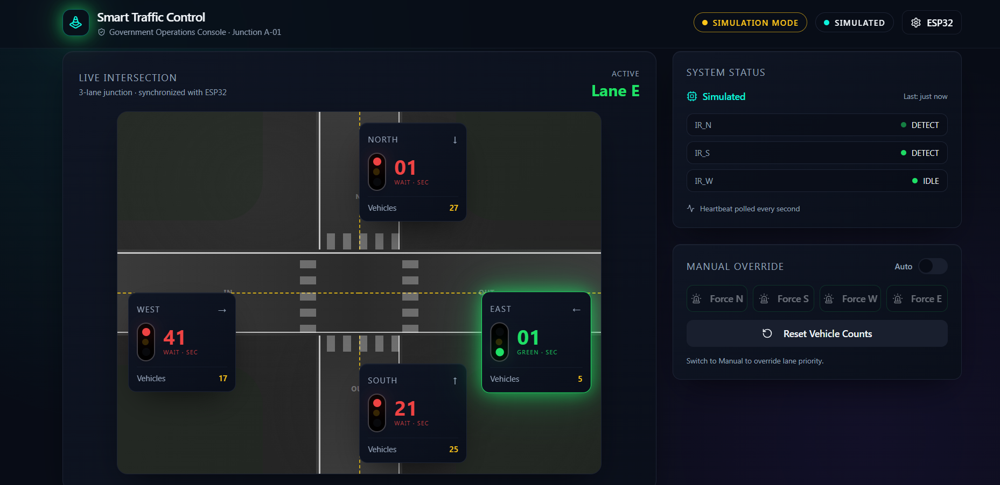
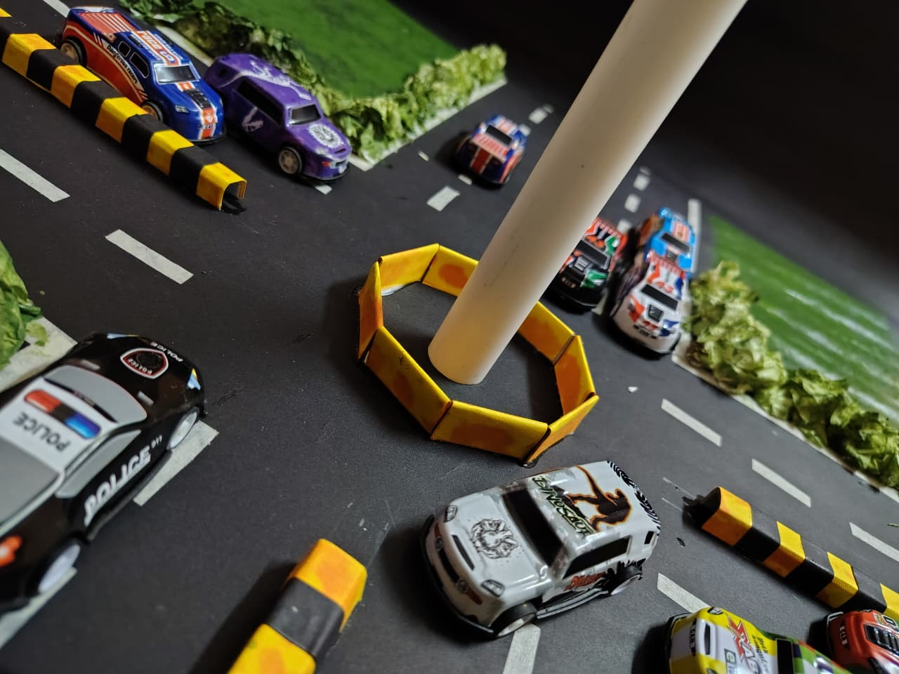

# SmartFlow — AI‑Assisted Smart Traffic Management System

SmartFlow is a 4‑lane smart traffic control system that combines an **ESP32‑based hardware controller** with a **React dashboard** for live monitoring, manual override, emergency‑vehicle pre‑emption (RFID), and red‑light‑violation logging.

The dashboard can run in two modes:

- **Hardware mode** — connects to a real ESP32 over WebSocket and visualizes live sensor / signal data.
- **Simulator mode** — runs a built‑in JS simulator that mirrors the Arduino logic, so you can demo the full system with no hardware.

Lanes: **N (North)**, **S (South)**, **W (West)**, **E (East)**.

---

## 📸 Project Showcase

### Dashboard (Web UI)


### Hardware Prototype



---

## ✨ Features

### Dashboard (Web)
- Live intersection view with 4 signal poles (N / S / W / E) and active‑lane countdown
- Per‑lane vehicle counters with addon‑green logic (+10s when queue ≥ 3)
- Manual override: **Force Green** for any lane, **Reset Counts**, **AUTO / MANUAL** mode
- Emergency vehicle pre‑emption via RFID (Ambulance / Fire Truck / Police)
  - Ignores detections if the requested lane is **already green**
  - Auto‑clears after configurable override duration (default 20s)
- Red‑light violation log with timestamped events
  - In simulator mode, violations are **manually pushed** per lane (no random fakes)
- Analytics chart with rolling per‑lane traffic
- Connection settings panel (WebSocket / REST URL, simulator toggle)

### Hardware (ESP32)
- Auto‑adaptive green time based on vehicle queue length
- IR sensor vehicle counting (only counts while a lane is RED)
- Dedicated IR sensor for red‑light violation detection
- 7‑segment TM1637 countdown displays per lane
- RFID (RC522) emergency vehicle recognition with authorized UID list
- Broadcasts live state to dashboard 2× per second over WebSocket

---

## 🧱 Architecture

```text
              ┌────────────────────────┐
              │  React Dashboard (UI)  │
              │  Vite + Tailwind + TS  │
              └─────────┬──────────────┘
                        │ WebSocket :81  (JSON)
                        │ REST /cmd      (fallback)
              ┌─────────▼──────────────┐
              │   ESP32 Controller     │
              │  WebSocketsServer + JSON│
              └──┬──────┬──────┬───────┘
       IR + LEDs │ TM1637│ RC522│
                 ▼       ▼      ▼
           Lane sensors  Displays  RFID reader
```

Protocol (ESP32 → Dashboard):
```json
{ "currentLane":"N", "remainingTime":12, "countN":2, "countS":0,
  "countW":1, "countE":0, "addonApplied":false, "mode":"AUTO" }
```
Events:
```json
{ "event":"VIOLATION", "lane":"W" }
{ "type":"emergency_vehicle", "rfid":"AMB101", "vehicle":"Ambulance",
  "lane":1, "priority":true, "duration":20 }
```
Commands (Dashboard → ESP32):
```json
{ "action":"FORCE_GREEN", "lane":"N" }
{ "action":"RESET_COUNTS" }
{ "action":"SET_MODE", "mode":"MANUAL" }
```

---

## 🚀 Getting Started (Dashboard)

### Prerequisites
- Node.js 18+ (or Bun)
- npm / pnpm / bun

### Install & run
```bash
npm install
npm run dev          # http://localhost:5173
```

Other scripts:
```bash
npm run build        # production build
npm run preview      # preview built app
npm run test         # vitest run
npm run lint         # eslint
```

### Using the simulator (no hardware needed)
1. Open the app, click the **⚙ ESP32** button (top‑right).
2. Enable **Use built‑in simulator**.
3. Save. The dashboard starts streaming simulated data immediately.
4. Push red‑light violations manually via the **Push N / S / W / E** buttons in the Violation Log header.
5. Trigger emergency vehicles manually from the **Emergency Panel** ("Simulate Detection").

### Connecting to real ESP32
1. Flash the firmware (see below) and open the Serial Monitor at 115200 baud.
2. Copy the printed URL, e.g. `ws://192.168.1.50:81/`.
3. In the dashboard ⚙ ESP32 panel, **turn Simulator OFF**, paste the WebSocket URL, Save.
4. Connection state in the header should switch to **connected**.

---

## 🔌 Hardware

### Bill of Materials

| Qty | Component | Notes |
|-----|-----------|-------|
| 1 | ESP32 DevKit v1 (38‑pin) | Any ESP32 with enough GPIOs works |
| 4 | IR obstacle sensors (FC‑51 or similar) | 3 for counting (N/S/W), 1 for W violation lane |
| 6 | LEDs (3 × Red, 3 × Green) | One R/G pair per lane (N, S, W) |
| 6 | 220Ω resistors | Series with each LED |
| 3 | TM1637 4‑digit 7‑seg displays | Countdown per lane |
| 1 | MFRC522 RFID reader + tags | Emergency vehicle ID |
| 1 | Breadboard + jumper wires | |
| 1 | 5V / 2A power supply | USB or barrel jack |

> The 4th lane (**E / East**) is currently **dashboard‑only** (visual + analytics). The hardware reference design covers N/S/W; E can be added by replicating the West lane wiring on free GPIOs.

### Pin Map (default firmware)

| Function | GPIO |
|----------|------|
| North RED / GREEN LED | 17 / 14 |
| South RED / GREEN LED | 5 / 4 |
| West  RED / GREEN LED | 25 / 32 |
| IR North (count) | 34 |
| IR South (count) | 33 |
| IR West  (count) | 26 |
| IR West  (violation) | 35 |
| TM1637 North (CLK / DIO) | 16 / 22 |
| TM1637 South (CLK / DIO) | 21 / 18 |
| TM1637 West  (CLK / DIO) | 13 / 23 |
| RC522 SS / RST | 15 / 2 |
| RC522 SCK / MISO / MOSI | 18 / 19 / 23 (HW SPI) |

> ⚠️ The default firmware shares some pins between TM1637 and SPI (e.g. 18/23). If you enable RFID, move the conflicting TM1637 pins to free GPIOs (e.g. 27, 12) before flashing.

### Wiring notes
- IR sensors output **LOW when a vehicle is detected** (active‑low).
- LEDs: anode → GPIO via 220Ω, cathode → GND.
- TM1637 displays: VCC → 3.3V, GND → GND, CLK/DIO → assigned GPIOs.
- RC522: VCC → **3.3V only** (not 5V), IRQ unused.
- Common ground between ESP32, sensors, displays, and LEDs.

### Wiring diagram (logical)

```text
         IR_N(34)              IR_S(33)
            │                     │
   ┌────────▼─────────┐  ┌────────▼─────────┐
   │  NORTH Lane      │  │  SOUTH Lane      │
   │  R:17  G:14      │  │  R:5   G:4       │
   │  TM1637 16/22    │  │  TM1637 21/18    │
   └──────────────────┘  └──────────────────┘
         IR_W(26)         IR_W_VIOL(35)
            │                     │
   ┌────────▼─────────────────────▼─────────┐
   │           WEST  Lane                   │
   │  R:25  G:32   TM1637 13/23             │
   └────────────────────────────────────────┘
                    │
              ┌─────▼─────┐
              │  RC522    │ SS:15 RST:2 (HW SPI)
              └───────────┘
```

---

## 🛠 Firmware (Arduino IDE)

### Required libraries (Library Manager)
- **WebSockets** by Markus Sattler
- **ArduinoJson** by Benoit Blanchon
- **TM1637** by Avishay Orpaz
- **MFRC522** by GithubCommunity (only if `ENABLE_RFID` is on)

### Build & flash
1. Open `arduino/SmartTrafficESP32/SmartTrafficESP32.ino` in the Arduino IDE.
2. Board: **ESP32 Dev Module**. Select the correct COM port.
3. Set your WiFi credentials at the top of the sketch:
   ```cpp
   const char* WIFI_SSID     = "YOUR_WIFI_NAME";
   const char* WIFI_PASSWORD = "YOUR_WIFI_PASSWORD";
   ```
4. (Optional) Edit the `AUTHORIZED[]` table to map your RFID tag UIDs to vehicles/lanes.
5. Upload, then open Serial Monitor @ **115200** and copy the printed dashboard URL.

### Runtime behavior
- Boots into AUTO mode, starts with **North** green.
- Cycles **N → S → W → N** (East is visual‑only on hardware).
- Counts vehicles only on **RED** lanes (no double counting during green).
- Triggers a violation event when the West violation IR fires while West is red.
- On valid RFID scan, switches to MANUAL, forces the corresponding lane green for 20s, then resumes AUTO.

---

## 📁 Project Structure

```
arduino/SmartTrafficESP32/   # ESP32 firmware (.ino)
src/
  components/traffic/        # Dashboard widgets (IntersectionView, ControlPanel, ...)
  hooks/                     # useEsp32, useEmergency
  lib/                       # traffic-simulator, esp32-parser, traffic-types
  pages/Index.tsx            # Main dashboard page
public/                      # Static assets
```

---

## 🧪 Tech Stack

- **Frontend:** React 18, TypeScript, Vite, TailwindCSS, shadcn/ui, Recharts, Framer Motion, Sonner
- **State / data:** TanStack Query, custom hooks, native WebSocket
- **Firmware:** ESP32 (Arduino core), WebSocketsServer, ArduinoJson, TM1637, MFRC522
- **Testing:** Vitest, React Testing Library

---

## 🤝 Contributing

PRs welcome. Please:
1. Fork and branch (`feat/<short-name>`).
2. Run `npm run lint && npm run test` before opening a PR.
3. Describe hardware changes (pin map, BOM diffs) in the PR body.

---

## 📜 License

MIT — see `LICENSE` 
